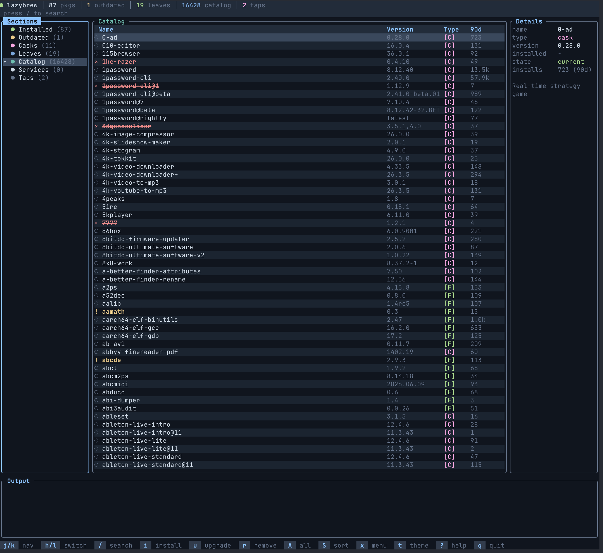
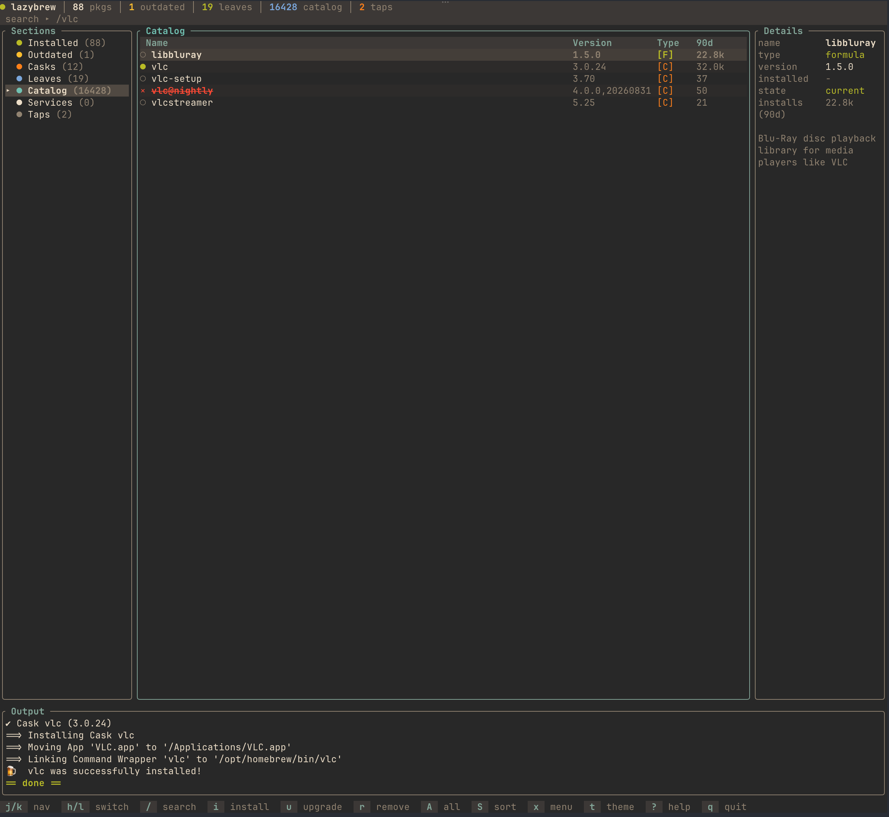

# lazybrew

A [lazygit]-inspired terminal UI for Homebrew, written in Rust with [ratatui].

Browse the full Homebrew catalog, manage installed formulae and casks,
services, taps, and Brewfiles — all without leaving the terminal.

## Screenshots

<p align="center">
  
</p>
<p align="center"><em>The main interface: sections sidebar, package table, details and output panes.</em></p>

<p align="center">
  
</p>
<p align="center"><em>A successful install: confirmation dialog, streamed output, done marker.</em></p>

## Features

- Lazygit-style layout: sidebar sections, package table, details pane, output pane
- **Sections**: Installed, Outdated, Casks, Leaves, Catalog, Services, Taps,
  and Brewfile (with `-f`)
- **Catalog**: browse all 15k+ remote formulae and casks (downloaded once a
  day, cached in the XDG cache dir, loaded in the background)
- Live search with `/`, install anything with `i`
- **Status badges**: deprecated (`!`, yellow) and disabled (`×`, red
  strikethrough) packages with reason + replacement suggestion in details
- **Popularity**: 90-day install analytics (cached daily) shown as a `90d`
  column in Catalog and in details; sort any list by installs with `S`
- **Maintenance**: reinstall and open-homepage from the action menu (`x`),
  `brew doctor`/`config`, `brew bundle check` for the `-f` file, and a
  warning before installing third-party taps showing where the package
  actually comes from
- Upgrade / remove / upgrade-all / cleanup / autoremove with confirmation
  dialogs and streamed command output
- **Services**: list and start/stop `brew services`
- **Taps**: list, tap, and untap
- **Brewfile mode**: `lazybrew -f ~/Brewfile` (local path or https URL) with
  install-all / remove-all
- **Vulnerability scan** (`brew vulns`) with cached results shown in details
- Pin/unpin, info, deps via the `x` action menu
- **Link / unlink** (`L` / `Y`, or the `x` menu): symlink a keg-only
  formula's files into the prefix, or remove those symlinks
- Brewfile export via `brew bundle dump` (`e`)
- **Theme switcher** (`t`): 6 built-in themes — Lazybrew, btop, Dracula,
  Nord, Gruvbox, Solarized — with live preview swatches; the choice is
  persisted to the XDG config dir
- **Self-update** (`W`): downloads the latest GitHub release for your
  platform and swaps in the new binary (the old one is kept as `.old`)
- Help overlay (`?`), animated loading and command spinners, pulsing
  busy-state cues, per-line output colorization

## Keybindings

| Key | Action |
|-----|--------|
| `j`/`k`, arrows | navigate |
| mouse | click a row or section, scroll the list with the wheel |
| `h`/`l`, tab | switch panel |
| `/` | search |
| `esc` | clear search / close |
| `pgup`/`pgdn` | scroll the output history |
| `g`/`G` | top / bottom |
| `i` | install the **selected** package (prompt in Taps section; reports if already installed) |
| `u` / `r` | upgrade / remove selected (untap in Taps section) |
| `L` / `Y` | link / unlink selected package (keg-only symlinks) |
| `A` | upgrade all outdated |
| `U` | `brew update` |
| `K` | `brew cleanup` |
| `n` | `brew autoremove` |
| `s` | start/stop service (Services section) |
| `S` | cycle sort mode — natural / name / installs (90-day) |
| `v` | vulnerability scan (formulae) |
| `x` | action menu — manage, inspect, link, health, services (navigate j/k, enter to run) |
| `D` | `brew doctor` |
| `C` | `brew config` |
| `B` | `brew bundle check` (needs `-f`) |
| `t` | theme picker (6 built-in themes, persisted) |
| `I` | install by typed name, tab completes against the catalog (install-all in Brewfile) |
| `R` | remove all (Brewfile section) |
| `e` | export Brewfile to `~/Brewfile` |
| `W` | update lazybrew itself (downloads the latest GitHub release) |
| `?` | help |
| `q` | quit |

## Install

```sh
cargo install --path .
```

## Usage

```sh
lazybrew                    # all installed packages + catalog
lazybrew -f ~/Brewfile      # Brewfile mode (local or https URL)
```

## Develop

```sh
cargo build
cargo test
cargo clippy
cargo fmt
# preview the layout as ASCII:
cargo test print_layout -- --nocapture
```

## License

MIT

[lazygit]: https://github.com/jesseduffield/lazygit
[ratatui]: https://ratatui.rs
